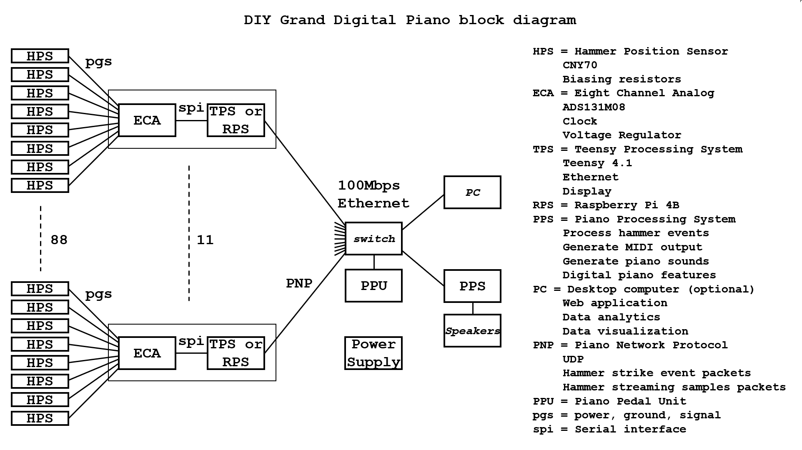

# DIY-Grand-Digital-Piano

## Goal

Build a full-custom hybrid digital piano using a complete grand piano action. 

In the spirit of "everything worth doing is worth overdoing", the design will be intentionally overdesigned and include many marginally useful features.

This is a hobby and so the approach may be driven primarily by curiosity on a subject, and not by efficiently getting to completion.

## Why?

It is fun.

It is a great way to learn so many new things.

## History

I started this project December 5, 2020.

## Related Projects:

Work was inspired, in part, by https://github.com/ekumanov/cybrid

* https://github.com/jkominek/piano-conversion/
* https://github.com/davidedelvento/Mybrid

## Block Diagram

## Documentation

Please see the file video_documentation.md in this directory.

## Roadmap

Create and build every component. This includes both sampled and modelled piano sounds.

Design and build architectural variants, to address different use cases.

Helping others build and create based on this work (for example, possibly open source options or kits).