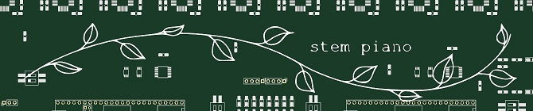

# DIY Hybrid Digital Grand Piano

Also known as **stem piano**

## How to Build Your Own Piano
Go straight to the [packages/](packages/) directory!

But first, please read the [WARNINGS](WARNINGS.md) and [HELP](HELP.md) files that are located in this root directory.

If you would like to contribute hardware, software, mechanical, or firmware to the project, see the [CONTRIBUTING](CONTRIBUTING.md) file.

## Goals

Build a full-custom hybrid digital piano using a complete grand piano action. 

Platform and code that easily adapts to building a range of other unique and innovative musical instruments.

This is a hobby and so the approach may be driven by curiosity on a subject, not by efficiently getting done.

## Directory Organization

The components required to build a piano are located in the [firmware/](firmware/), [hardware/](hardware/), [mechanical/](mechanical/) and [software/](software/) directories. Within each of these directories is a *research* subdirectory and a *releases* subdirectory.

Each *research* subdirectory contains code and hardware for work in progress. It could have major bugs. It could be incomplete.

Each *releases* subdirectory contains code and hardware ready for use. The material in *releases* could partially duplicate material in one or more *research* subdirectories. However, the requirement is that anything in *releases* is well-tested, complete, and ready-to-use.

More details on each directory:

#### documentation/

High level documentation. Additionally, detailed documentation is located throughout the repo.

#### packages/

Building a complete piano requires firmware, hardware, mechanical, and sometimes software. The packages/ directory provides information on everything needed to build a specific version of a musical instrument.

#### firmware/

Real-time code running on custom hardware from *hardware* directory.

#### hardware/

All printed circuit boards and related parts and design. A separate open-source license for the hardware is in this directory and applies only to the contents of this *hardware/* directory.

#### mechanical/

Anything to physically build a piano. A separate open-source license for mechanical is in this directory and applies only to the contents of this *mechanical/* directory.

#### software/

Code running on a standard computer or Raspberry Pi connected to the piano over Ethernet or MIDI.

## Why?

Fun.

Great way to learn new things.

New: make hybrid pianos and tools to create innovate musical instruments more accessible.

## History

Started December 2020.

Please see [YouTube Posts](documentation/video_documentation.md) for historical, how-to, and other documentation in video form.

## Related Projects:

Work was inspired, in part, by https://github.com/ekumanov/cybrid

See also:

* https://github.com/jkominek/piano-conversion/
* https://github.com/davidedelvento/Mybrid
* https://www.youtube.com/watch?v=nRBsudMpwwc

## "stem piano" because?

* science technology engineering math
* like a plant stem, everything here is one component of the overall instrument
* like a note stem, everything here is one component of...
* 12 leaves on the logo, matches 12 piano notes
* sounds cool
* does not sound cool