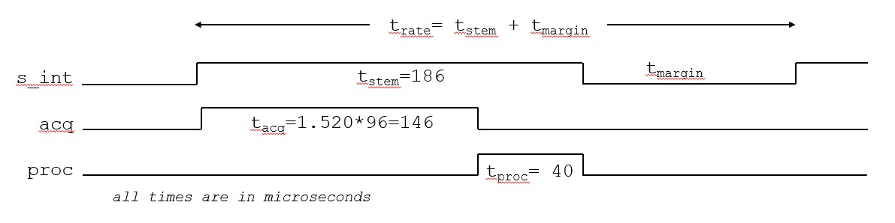
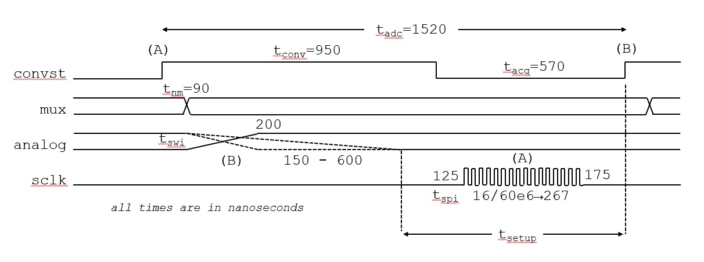

# Timing Diagrams for ECA 0.X / IPS 2.X

Design is for:
* Firmware: *six_channel_analog_00.cpp* located here: [../../../firmware/releases/StemPianoIPS2/](../../../firmware/releases/StemPianoIPS2/)
* Hardware: [../../../hardware/releases/sca00](../../../hardware/releases/sca00)
* Hardware: [../../../hardware/releases/ips20](../../../hardware/releases/ips20)

Pianos:
* Stem Piano G: [../../../pianos/StemPianoG/](../../../pianos/StemPianoG/)

Timing requirements are from [1], [2], and [3].

All timing values below were verified with an oscilloscope.

## Top Level Timings (No Damper Board Option)

* *t_rate* = Overall sample rate. Set by the variable *adc_sample_period_microseconds* in the file *hammer_settings.cpp* located here: [../../../firmware/releases/ips2_hammer/](../../../firmware/releases/ips2_hammer/).
* *t_stem* = Total time for all piano processing. With a damper board this time increases because of the CAN bus processing time.
* *t_margin* = Extra margin. Set *t_rate* so that *t_margin* is large enough to accommodate interrupts, processing variability (if/else paths), and any other statistical cases. Larger is safer. Smaller increases the overall sample rate.
* *t_acq* = Total acquisition time for all 96 analog channels. The value 1.520 is from the diagram in the **Data Acquisition** section of this document.
* *t_proc* = Total processing time for all firmware running on the Teensy, except data acquisition. Examples:
    * Hammer, damper, and pedal processing
    * Ethernet
    * MIDI
    * CAN bus (if using a separate damper processing board)
    * Switches, test points, LEDs
    * Run-time calibration
    * TFT display
    * Overhead code and miscellaneous tasks

## Data Acquisition

The data acquisition is pipelined. An analog input value is sampled by the ADC at first *convst* rising edge (A) and the conversion result is sent to Teensy on SPI *sclk* shown. The firmware switches the PCB multiplexers to input analog value (B) immediately after *convst* rising edge. Switching early increases total settling time margin. The new analog input value (B) is sampled at second *convst* rising edge.

* *t_adc* = Processing time for a single input. Must be larger than 1000 nanoseconds [1][2][3].
* *t_conv* = Time to convert a single channel. Must be larger than 710 nanoseconds [1][2][3].
* *t_acq* = Time to acquire a channel. Must be larger than 290 nanoseconds [1][2][3].
* *t_nm* = Time for Teensy to calculate mux values for next channel.
* *t_swi* = Time for analog settling after 16:1 and 8:1 muxes switch. Must completely settle prior to *t_setup*. The minimum *t_setup* value is 290 nanoseconds [1][2][3]. From the diagram, measured *t_setup* is over 800 nanoseconds. So, the design has good settling time margin.
* *t_spi* = SPI timings. Example shown is for a 60 MHz SPI clock frequency.

## How To Speed Things Up?

To sample piano hammers and dampers faster, the following are possible. After making changes, must validate that the *t_stem* + *t_margin* are not longer than the processing interval timing code in *src_hammer.cpp*. Verify using an oscilloscope.

Options:

* Decrease *t_conv* closer to the 710 nanosecond minimum. The present design uses a timer which is very conservative, but guaranteed. To go faster, change firmware to rely on processing timings. After *t_conv* is smaller, then decrease *adc_sample_period_microseconds* accordingly in the settings file.

* Speed up SPI clock. The max rate is 70MHz. The present design is 60MHz to give extra timing margin. After changing the clock frequency, decrease *adc_sample_period_microseconds* accordingly in the settings file.

* Decrease *t_margin*. Do this by decreasing *adc_sample_period_microseconds* directly in the settings files.

* Optimize Teensy processing firmware to decrease *t_proc*. After *t_proc* is smaller, then decrease *adc_sample_period_microseconds* accordingly in the settings file.

* Add more ADC in parallel by designing a new SCA board! Increment the SCA major version number (for example, call it SCA 1.0). Must not require changing the more expensive IPS board.

## References

[1] "ADS8860: 16-bit, 1-MSPS, serial interface, single-ended input, SAR analog-to-digital converter", Texas Instruments, February 2019.

[2] "ADS8861: 16-bit, 1-MSPS, serial interface, true-differential input, SAR analog-to-digital converter", Texas Instruments, December 2013.

[3] "ADS8881: 18-bit, 1-MSPS, serial interface, true-differential input, SAR analog-to-digital converter", Texas Instruments, August 2015.