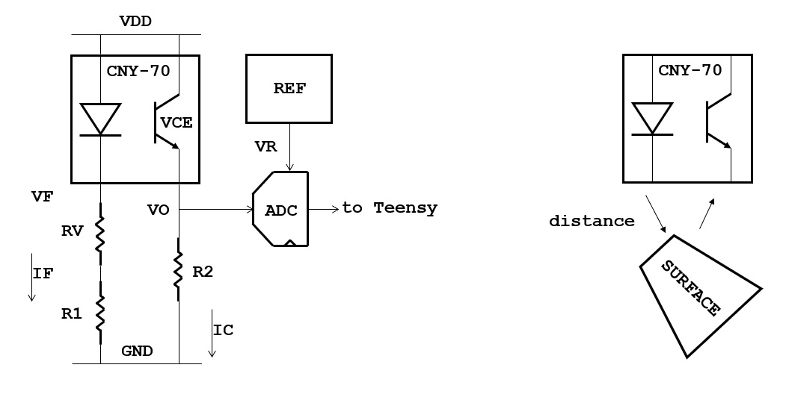

# Analog Front-End for HPS, using CNY-70

This directory contains information on the analog front-end design for *stem piano* using the Hammer Position Sensor (HPS) boards with CNY-70 sensors.

Selecting the HPS resistors and getting an output voltage in the correct range could involve some trial-and-error testing when building a *stem piano*. The reason is because of many influences on the output voltage:
* Reflective surface.
* Variation between CNY-70 parts.
* Physical distance between hammer shank and the CNY-70.

This document explains the reasons behind resistor values in the bill of materials for the HPS boards. Understanding the design and resistor selection process is helpful because each piano is unique and could require adjustments.

The project progress YouTube videos https://www.youtube.com/@gzpiano88 may prove helpful and links are provided below.

## HPS Block Diagram

The R1, R2, and RV values are in the HPS bill of materials. Also in the bill of materials is the REF integrated circuit component (unless integrated with the ADC). The information below explains how values are selected. Additional resources are the CNY-70 data sheet [1] and application guide [2]. See end of this file for the full names of those documents.

## Definitions

### HPS Components
* CNY-70 = Optical sensor.
* ADC = Analog to Digital Converter.
* REF = Something generating the ADC reference voltage. This is an external integrated circuit or it is included with the ADC.
* SURFACE = Reflective surface such as a hammer shank or the damper location at back of a piano key.
* R1 = Resistor to set forward current IF.
* RV = Optional adjustable resistor to compensate for variation from one CNY-70 to another CNY-70. See this video for an explanation of the CNY-70 variation issue: https://www.youtube.com/watch?v=C9174TC4kLs
* R2 = Resistor to set the value of VO when CNY-70 distance is closest to the SURFACE.

### Electrical Quantities
* VDD = Power supply voltage.
* GND = Ground.
* VO = Output voltage of the sensor board, with respect to GND.
* VF = Emitter voltage, with respect to GND.
* VR = Reference voltage, with respect to GND.
* VCE = Voltage across the receiver. Measure as VDD - VO.
* IF = Forward current of light emitter.
* IC = Collector current at light receiver.

### Physical Quantities

* *distance* = vertical distance from the CNY-70 to a reflective surface.

## Design Constraints

* VO must always be within the input range of the ADC.
    * VO > 0
    * VO < VR 

* VF is set by the CNY-70. See CNY-70 data sheet [1]. A typical value is 1.2V.

* VR is selected during design. Primarily considerations on the value VR include keeping VCE in proper range when VO is at its largest value and using the maximum ADC dynamic range over all values of VO.

* VCE must be within the constant current range specified by CNY-70 data sheet figure 6 [1]. Typical ranges:
    * VCE > 0.4V
    * VCE < 10V

* Forward current IF. The upper range limit listed here is smaller than the datasheet because the *stem piano* design takes into account worst-case temperature [2] restrictions.
    * IF > 5mA
    * IF < 25mA

* For collector current IC, see CNY-70 data sheet [1] figure 9 for an example of IC vs *distance*.

## Design Principles

### Use the Full Range for VO

The ADC receive a voltage VO from the HPS sensor board, and then the ADC outputs an integer value to the Teensy microprocessor. The Teensy microprocessor normalizes that integer value into a floating-point value in range [0, ..., 1]. When VO = 0, the floating-point value is 0.  When VO = VR, the floating-point value is 1. When VO = *X* * VR, the floating-point value is *X*, where 0 < *X* < 1.

* When the *distance* is at its largest value (hammer shank is at rest), VO is close to zero, and the Teensy value is close to 0.
* When the *distance* is at its smallest value (hammer shank is hitting the hammer stop bar), VO = VR, and the Teensy value is 1.

The algorithms in the Teensy are designed for values in the full range [0, ..., 1]. If less than the full range are used, it could cause problems for the algorithms.

Often the smallest value is larger than 0. For example, 0.2. This is ok. However, if the largest value is larger than 1 or too much smaller than 1, this can cause problems.

The range of VO depends on R1, R2, and the *SURFACE* reflectivity.
* A smaller (R1+RV) or larger R2 results in a larger VO.
* A larger (R1+RV) or smaller R2 results in a smaller VO.
* A more reflective *SURFACE* results in a larger VO.
* A less reflective *SURFACE* results in a smaller VO.

### Examples of VO Not Full Range

#### R1 too large or R2 too small or *SURFACE* not reflective enough
Consider a scenario where the voltage output VO = VR/2 when the hammer shank is hitting the hammer stop bar, instead of at the expected value of VO = VR. Then the Teensy computes a value of 0.5. In this case, if an internal algorithm is expecting something closer to 1.0 (for example 0.8), the Teensy might not infer that the hammer hit the stop bar. And, the Teensy might not output a MIDI event, even though the hammer did hit the hammer stop bar.

#### R1 too small or R2 too large or *SURFACE* too reflective
Consider if VO = 1.1 * VR when the hammer shank is hitting the hammer stop bar. Then the ADC clips the signal, because the signal exceeded VR. In this case, because of clipping, the Teensy gets a value of 1.0 instead of 1.1. This causes problems for the Teensy algorithms.

#### Problems for VO and hammer at rest
As another example, consider a scenario of VO = VR/2, instead of VO closer to zero when the hammer is at rest. In this case the Teensy may think that a key is being held down, and may not release the sustain MIDI signal.

### Selecting the Correct values of R1, RV, R2, and *SURFACE* reflectivity

The resistor values in the HPS bill of materials were selected by engineering analysis and then by testing many CNY-70. The resistor values attempt to ensure VO < VR for all variants of CNY-70. This means that for some CNY-70, the output voltage VO is much less than VR.

Unfortunately, each CNY-70 exhibits a slightly different response for the same values of R1, RV, and R2. Some CNY-70 output larger VO and some CNY-70 output smaller VO. The following subsections describe solutions if VO is too small or too large on for some CNY-70.

#### VO Too Small

* Correct by firmware calibration in the Teensy. Measure the output and multiply by a constant to increase the floating-point value.
* Correct by using a version of HPS with VR, and adjust VR smaller to increase VO until VO = VR when the *distance* is at its smallest value. See [../../hardware/releases/hps07/README.md](../../hardware/releases/hps07/README.md) for directions on adjusting VR.
* Test many CNY-70 and throw away the ones with small output voltages when in the HPS circuit configuration.
* Use a more reflective surface. When selecting R1, RV, R2 in the bill of materials, the system was tested with a white sheet of printer paper. White printer paper has one of the highest reflective surfaces according to [2]. When the circuit boards are installed on the piano, if the *SURFACE* is the piano shank wood, it will have a lower reflectivity. Then VO is lower. If VO is too low (for example, the piano does not play at all or plays poorly), put white stickers on each piano shank or damper.  See https://www.youtube.com/watch?v=ZMxMio3L9dk at approximately 0:45 time mark for an example. Another option is white paint.

#### VO Too Large

*IMPORTANT* - In general, it is better to select R2 too small than too large (similarly it is better for too large R1 than too small). A value of R2 too small makes VO too small and that could cause problems described above. However, these problems are fixable with firmware. However, if R2 is too large (similarly R1 too small), the output voltage VO clips. The firmware cannot fix clipping because the signal is distorted. If the signal clips, fix it in hardware either by:
* Correct by using a version of HPS with VR, and adjust VR later to decrease VO until VO = VR when the *distance* is at its smallest value. See [../../hardware/releases/hps07/README.md](../../hardware/releases/hps07/README.md) for directions on adjusting VR.
* Test many CNY-70 and throw away the ones with VO > VR when in the HPS circuit configuration.
* Using a less reflective surface, such as adding a sticker or paint with less reflectivity.

To avoid clipping, the goal of resistor values in the HPS bill of materials is that when the hammer is hitting the hammer stop bar, the output voltage VO is slightly less than VR.

### Circuit Testing

Before assembling a *stem piano*, it is recommended to test each HPS board to check that VO < VR when the CNY-70 is very close to *SURFACE* and in the *stem piano* HPS circuit configuration.

See these videos for examples of process:
* https://www.youtube.com/watch?v=uJTaKLZaluc at approximately the 2:20 time mark.
* https://www.youtube.com/watch?v=w0TpXvcRCsM at approximately the 1:15 time mark. The target output voltage in the video is for a first generation architecture. Other architectures use other maximum voltage values. Check instructions for each piano to find the correct maximum output voltage for that piano.

Options:

* Assemble the entire *stem piano*. Manually move each piano shank up and down between rest position and contacting the hammer stop bar. Visually observe the internal Teensy float value by one of the following methods:
    * Best option: edit the firmware so the Arduino serial monitor displays the Teensy internal float value for each key, one at a time.
    * Alternate: write software on a computer that receives Ethernet values from the *stem piano* and displays the results on a computer.
    * Alternate: install the TFT display on the circuit board. Select a switch to enable the display (if this is the option in the version of *stem piano* built). The display shows the internal Teensy float value.
* Build a small prototype breadboard test station. Connect a power supply and ground to the power and ground HPS pins. Connect the HPS output voltage to a multimeter or oscilloscope. Move a piece of white paper close to the CNY-70 sensor. Measure the output voltage and check that it is in proper range.

## Other Considerations

According to [2], a smaller value of R2 results in a larger bandwidth. R2 = 2000 ohms is approximately 10KHz bandwidth. Tests show R2 < 5000 ohms work ok.

The CNY-70 output voltage degrades with time [2]. Expect 10% loss at 1,000 hours and 20% loss at 10,000 hours. However, at normal room temperature the lifetime is longer [2]. If after many years the piano does not play as well, check the voltage VO of each CNY-70 with a multimeter or oscilloscope.

Room lighting and ambient lighting could interfere with the CNY-70 operation [2].

The output voltage VO could drop suddenly if the *distance* between CNY-70 and *SURFACE* gets very close to zero. When building the sensor bar and piano frame, position each CNY-70 so that when the hammer shank or damper is at the closest value to the CNY-70, there is at least a gap thickness of a few sheets of paper. However, as this gap gets larger, the maximum VO will decrease. So, the *distance* gap cannot be too large.

The piano note volume consistency is sensitive to the consistency of the CNY-70 and hammer shank gap between keys.

## References

These documents are on the Vishay website.

[1] *"Reflective Optical Sensor with Transistor Output"*, CNY-70, Vishay Semiconductors, Rev. 1.8, 30-Jul-12.

[2] *"Application of Optical Sensors"*, Rev. 1.0, 27-Sept-06.