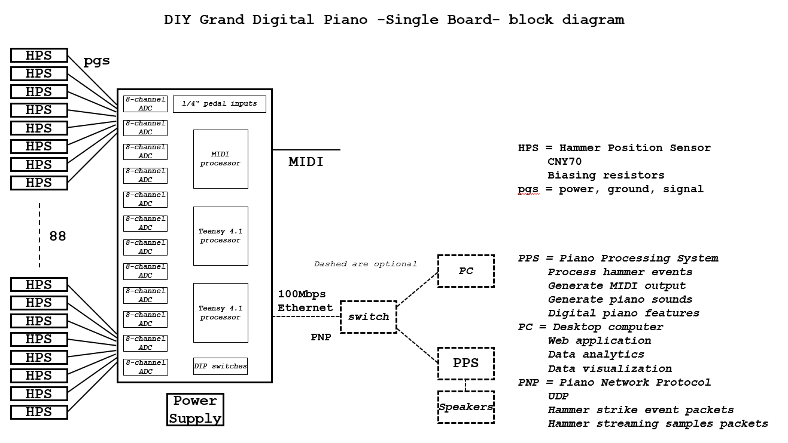
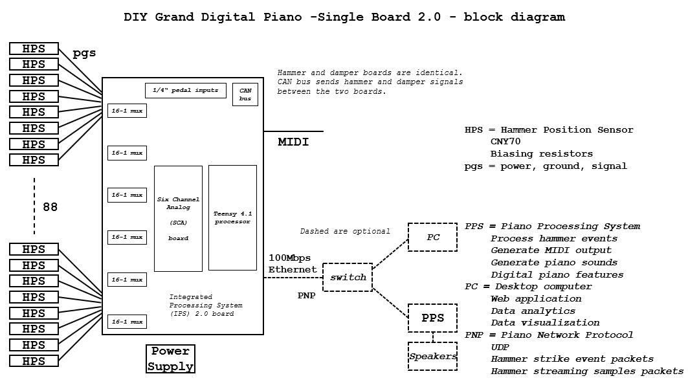

# DIY Hybrid Digital Grand Piano - High Level Documentation

Three versions of the piano are in development. More are likely in the future. Further details, design, code, and hardware is in the root level *firmware*, *hardware*, *mechanical*, and *software* directories.

If a piano based on one of these architectures is stable enough for release, then information on all components required to build the piano is in the root level *pianos* directory.

## Performance Architecture
The original architecture.

Designed for maximum performance, without constraining cost or practicality. Sampling is fully parallel and in range 8Ksps to 32Ksps.

## Single Board Architecture 0.0
First single board architecture. An attempt to simplify and lower the cost. Sampling is fully parallel and in range 2Ksps to 8Ksps. Results show this architecture gives up performance without much benefit to simplicity or cost.

## Single Board Architecture 2.0
Calling it "1.0" is too boring. Straight to 2.0!

Initially, this architecture was developed for damper processing. It was called the Damper Position Processor. Dampers do not need high-speed sampling and so, for dampers, sampling was fully sequential (a single ADC, multiplexed).

However, after testing and thinking more about it, I combined parallel plus sequential sampling into a design that scales from damper to hammer speeds. Preliminary analysis shows that the upper sampling limit could be close to the original performance architecture.

## Components Include:

Processors:
* Teensy 4.1 ARM Processor - https://www.pjrc.com/store/teensy41.html
* Raspberry Pi - https://www.raspberrypi.com/

Digital:
* Teensy to ADC interface logic ICs

Displays:
* Adafruit 2.8 inch TFT display - https://www.adafruit.com/product/1770

Analog:
* Texas Instruments ADS131M08 - https://www.ti.com/product/ADS131M08
* Texas Instruments ADS8861 - https://www.ti.com/product/ADS8861
* Texas Instruments ADS8860 - https://www.ti.com/product/ADS8860
* Texas Instruments ADCS7476 - https://www.ti.com/product/ADCS7476
* LTC6930 Precision Oscillator - https://www.analog.com/en/products/ltc6930.html
* 300mA - 500mA Low Dropout Linear Regulator
* 16:1, 8:1, and similar analog multiplexers
* CNY70 Sensor - https://www.vishay.com/en/product/83751/

Languages:
* Python - https://www.python.org/
* Matlab - https://www.mathworks.com/products/matlab.html
* C++

Printed Circuit Boards:
* OSH Park - https://oshpark.com/

## Video Documentation

Please see [YouTube Posts](video_documentation.md) for historical, how-to, and other documentation in video form.