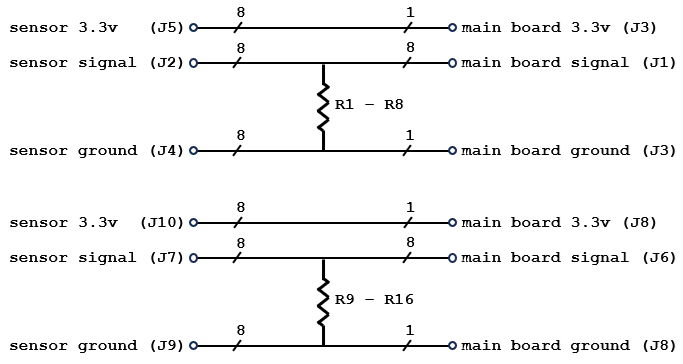
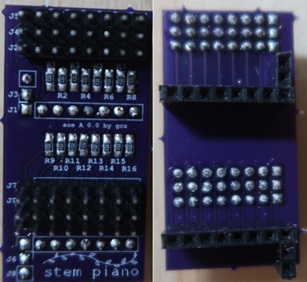
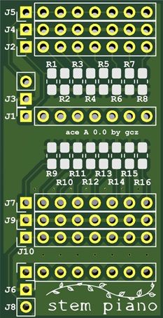

# Analog Condition Equalize (ACE) "A" - Version 0.0

## Introduction

The ace A is an interposer card between sensors and mainboard for analog signal translation.

Each ace A snaps onto the mainboard at 16 sensor connections at rear of mainboard.

Each interposer function is identified by a letter.

| Letter | Function                          |
|--------|-----------------------------------|
|    A   | Resistor load (this README file)  |
|    B   | Transimpedance amplifier (future) |
|    Z   | Pass through (future)             |

## Description

Each ace card connects 16 sensors to the mainboard. See the specific stem piano construction documentation for connection details.

Circuit diagram.

Top and bottom side of ace A.

## I/O

Note - Unlike the stem piano mainboards, the ace A boards do not have "input", "3.3v", and "ground" labels. Refer to the associated mainboard for double checking connections.

### Connections to mainboard.

These socket connectors are on the bottom side of ace A.

Note - J6 label is next to J8. It should be next to the adjacent eight pin connector footprint that is 0.1 inches above J8.

| Connector | Function                                   |
| --------- | ------------------------------------------ |
| J1        | Connects to 8 mainboard sensor input pins. |
| J6        | Connects to 8 mainboard sensor input pins. |
| J3 pin 2  | Pin near J1. Connects to mainboard ground. |
| J3 pin 1  | Connects to mainboard 3.3v output.         |
| J8 pin 2  | Pin near J6. Connects to mainboard ground. |
| J8 pin 1  | Connects to mainboard 3.3v output.         |

### Connections to the sensors.

These pin connectors are on the top side of ace A.

| Connector | Function                          |
| --------- | --------------------------------- |
| J2        | Connects to 8 sensor outputs.     |
| J7        | Connects to 8 sensor outputs.     |
| J4        | Connects to 8 sensor grounds.     |
| J9        | Connects to 8 sensor grounds.     |
| J5        | Connects to 8 sensor 3.3v inputs. |
| J10       | Connects to 8 sensor 3.3v inputs. |

### Size
* 1.84 inches by 0.95 inches.
* Single board.