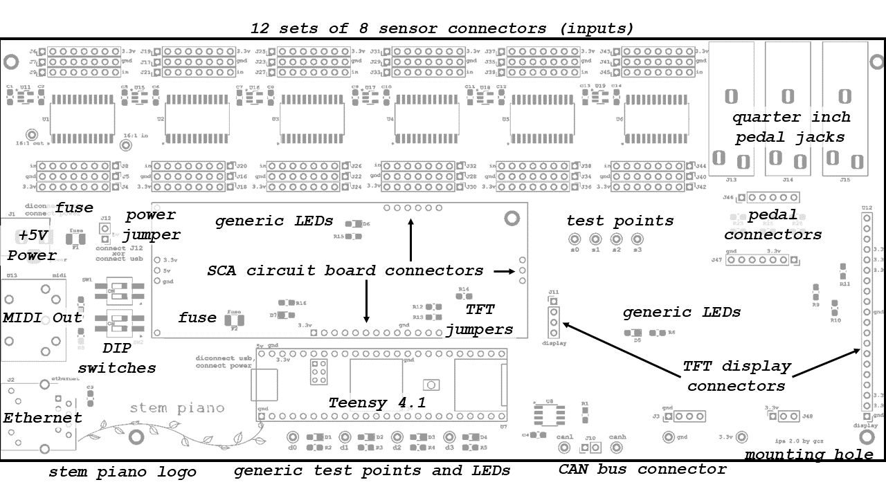
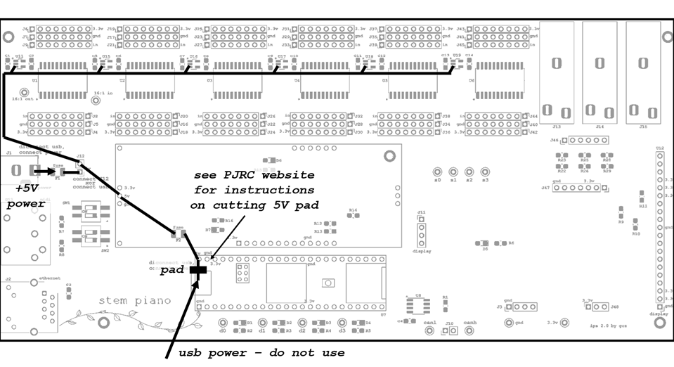
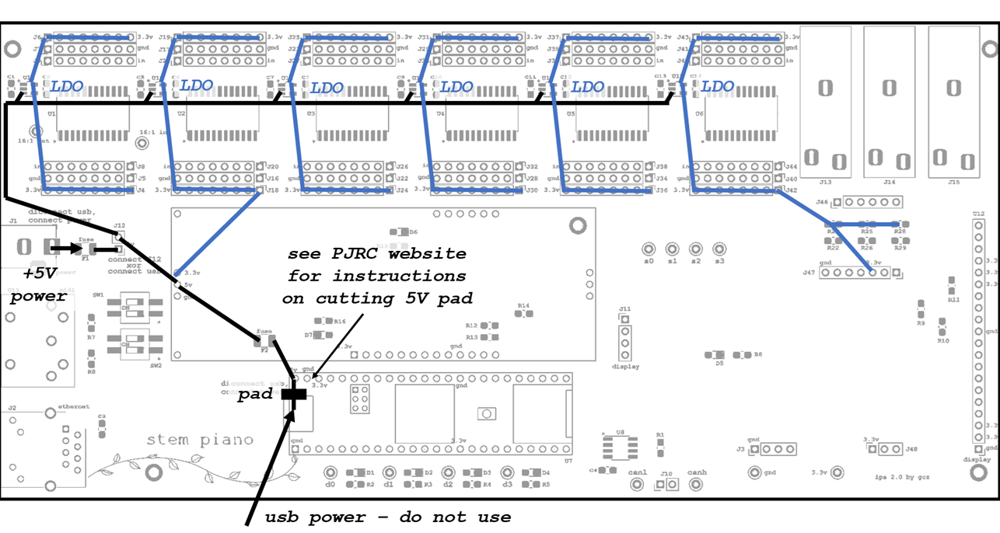
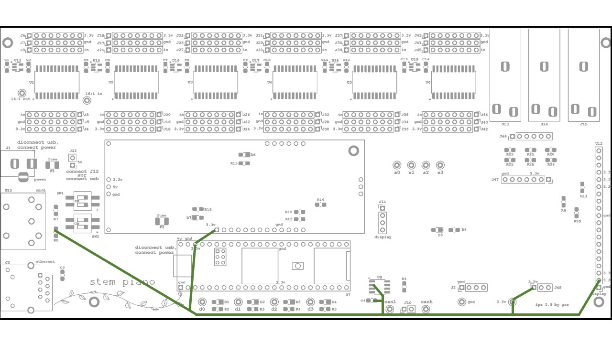

# Integrated Processing System 2 (IPS2) specification

The mainboard for hammer or damper sensor connections and Teensy 4.1 processing.

## Features

### I/O
* The board supports 96 sensor inputs.
  * Either:
    * Analog interfaces to 88 hammer sensor boards, or
    * Analog interfaces to 88 damper sensor boards.
  * 3 pedal inputs: 1/4 inch.
  * With less pedal inputs, it is also possible to use extra inputs for more than 88 piano keys.
  * With less piano key inputs, it is also possible to have more pedal inputs.
* MIDI output.
* Ethernet interface (optional).
* 5 volt, 2.5 amp power input.
* CAN bus.

### Capabilities
* Process hammer samples and generate MIDI outputs.
* Process damper samples and send to hammer processing board.
* Process pedal samples and generate MIDI outputs.
* Dual in-line package switches for configuration.
* Optional advanced monitoring, setup, and analytics over Ethernet and web brower.
* Optional hammer and pedal data over Ethernet using the piano network protocol (PNP).
* Optional TFT display for setup.

### Components
* Selected for availability.
* Relatively large pitch, relatively easy to solder parts.
* Requires a Six Channel Analog (SCA) card.

## Form
* 8.5 inches by 4.0 inches.
* Single board.

## Top Level PCB Description

### Sensor connectors
0.1 inch spaced connectors for connecting wires to the Hammer Position Sensor (HPS) boards. Does not require HPS boards. Can connect to any sensor system that meets input signal requirements.

### Quarter inch pedal jacks
For connecting pedals.

### Pedal connectors
0.1 inch spaced connectors J46. Connect to six of the sensor connectors. See instructions in the *pianos/* directory for this board.

### +5V power
External power connection. Do not connect external +5V power while Teensy 4.1 is connected to a USB cable that is supplying power from an external source. Cut the 5V pad on Teensy 4.1 per instructions at PJRC website.

https://www.pjrc.com/teensy/external_power.html

### Fuse
Location for fuses. The +5V power and USB must must automatically protect from short circuits, overcurrent, thermal, and all other failure conditions. User to decide on PCB fuse design and strategy.

### Power jumper
Install only after 5V pad on Teensy 4.1 is cut per instructions at PJRC website.

https://www.pjrc.com/teensy/external_power.html

### MIDI Out
Five-pin MIDI output connection. The board does not have a MIDI input.

### Ethernet
Ethernet connection.

### DIP switches
For simple configuration settings. Programmable with the Teensy firmware. See code for functionality.

### SCA circuit board connectors
The analog-to-digital conversion (ADC) subsystem is on a separate, removable, card that connects to the IPS printed circuit board. This simplifies and reduces the cost of testing an ADC and enables experimenting with different hammer or damper ADC resolution and sampling rates. Also, ADC parts can often be in packages that are difficult to solder. A separate circuit board lowers the cost and impact of soldering mistakes.

Headers J3, J47, and J48 make it possible to increase the size of the SCA. This allows larger and more complex analog circuits. In this case, either do not use the TFT, or use longer connectors so the TFT is above the SCA.

### Generic test points and LEDs
Programmable test points and LEDs through the Teensy firmware.

### Teensy 4.1
What makes everything possible.

### TFT jumpers
Zero-ohm resistors R12, R13, and R14. Only needed if TFT display is connected.

### CAN bus connector
Connect two wires between hammer and damper circuit boards. If not using a damper circuit board then leave these disconnected. Connect each wire to the same location on the other board (left side of connection to left side, right side to right side).

### TFT display connectors
Connection for optional 2.8-inch display.

### stem piano logo
Yeah!!

## Power Supplies and Connections

### +5 Volt Input

See black lines in figure below.

Cut the external computer power through the USB at Teensy 4.1 according to instructions on the PJRC website.

https://www.pjrc.com/teensy/external_power.html

Do not connect both external +5V power and USB power inputs at the same time. See the PJRC website for more information, including how to cut a Teensy 4.1 pad to avoid shorting the two power inputs together.

The external power supplies must automatically protect from short circuits, overcurrent, thermal, and all other failure conditions.

The external power supplies must be able to deliver 1.75 amps. This value is calculated by summing all current values in sections below and by testing. See *stem piano* video at the approximate 2:20 time https://www.youtube.com/watch?v=TemXGmkoc-g

A typical USB port on a computer may not be able to supply a full 1.75 A. Therefore, the board will not be able to run all 88 keys sensors unless the board is powered by an external +5V power supply, through the +5V power jack. In this case (and in all cases when using the +5V external power), see instructions on https://www.pjrc.com website for cutting the 5V pad on Teensy processor.

### +3.3 Volt Analog

See blue lines in figure below.

There are six Low Dropout (LDO) voltage regulators. Each converts +5V to +3.3V. Each LDO powers a single 16:1 analog multiplexer plus 16 remote sensors.

If using an HPS board for remote sensor, then the total current out of an LDO for sensors is given by the following equation:

16 * 14 mA = 224 mA.

According to its data sheet, the 16:1 analog mux worst-case current draw is 16mA (use twice the (ICC + delta ICC) values).

Some of the LDO integrated circuits power either the pedal circuit or (optionally) the SCA.
* The pedal circuit draws approximately 5 mA.
* The SCA current draw depends on the SCA circuit. Seems unlikely this would exceed 50mA absolute maximum.

Summing all numbers above gives a worst-case current for an LDO:
224 + 16 + 50 = 290 mA.

The SCA also has a second +3.3V input (see later section below) which can be used instead.
In this case the worst case current for an LDO:
224 + 16 = 240 mA.

Select the LDO based on above math. The LDO in [ips20_bill_of_materials_0.txt](ips20_bill_of_materials_0.txt) was selected based on the above math.

### +3.3 Volt Analog Ground

Ground pins are labeled on the PCB.

Be careful not to accidentally short a +3.3V pin with a ground pin.  For safety, select an LDO that tolerates a shorted output indefinitely. The LDO in [ips20_bill_of_materials_0.txt](ips20_bill_of_materials_0.txt) was selected based on this criteria.

### +3.3 Volt Digital

See green lines in figure below.

The Teensy 4.1 includes a 3.3V output (green).

This output is connected to the SCA, the Can bus, the TFT display, the MIDI connector, and one of the optional SCA headers (J48).

According to the PJRC website, the maximum output current that the Teensy's +3.3V pin can tolerate is 250 mA.

According to the display datasheet, the TFT display (far right connector) takes 80 mA.

According to the Can bus datasheet, the Can bus integrated circuit (middle bottom) takes less than 60 mA normally but can take as much as 180 mA during a bus fault.

When designing an SCA board that uses the +3.3V Digital input, the current draw of TFT display and Can bus must be considered.

According to a Teensy 4.1 schematic on the PJRC website, there is an LDO on the Teensy 4.1 that drives the 3.3V digital power supply, from the +5V power input. Reading information from PJRC website, the LDO appears maybe can tolerate a shorted output indefinitely. However, for safety, do not accidentally short the +3.3 Volt Digital line to ground.

## Design
Location of timing analysis: [../../../design/data_acquisition/eca0X_ips2X/eca0X_ips2X_timing_design.md](../../../design/data_acquisition/eca0X_ips2X/eca0X_ips2X_timing_design.md).
