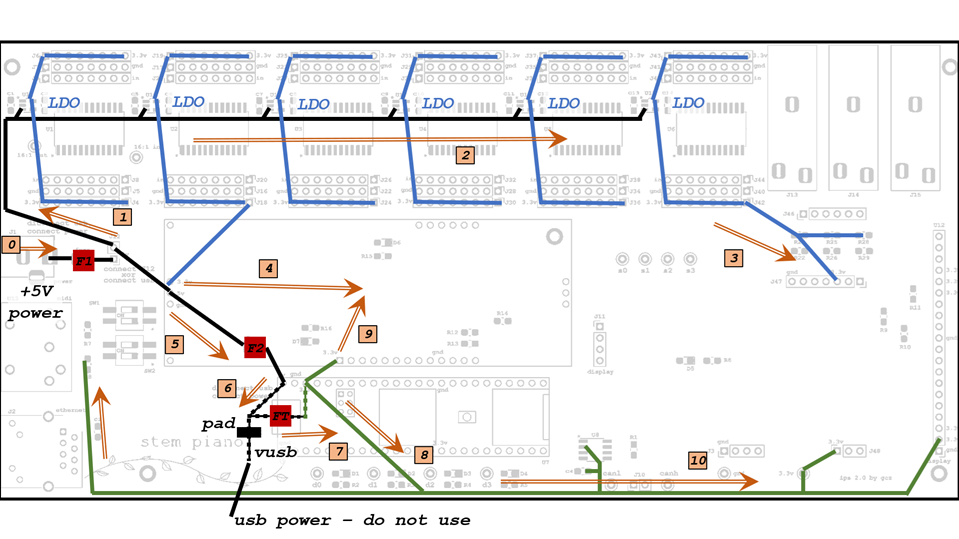

# Integrated Processing System 2 (IPS2) power

All external power supplies must automatically protect from short circuits, overcurrent, thermal, and all other failure conditions. See https://github.com/stem-piano/stem-piano-top/blob/main/WARNINGS.md.

## Diagram

The IPS circuit board is powered through the "+5V power" input at middle left of IPS circuit board.

## Pad

Cut the 5V pad (labeled "pad" on diagram above) on Teensy 4.1 processing PCB per instructions at PJRC website before installing the Teensy 4.1 processing PCB. https://www.pjrc.com/teensy/external_power.html

## Diagram Description

Items: (line routing in diagram is similar to but not exactly as traces on PCB):
* Black = +5 volt lines.
* Blue = +3.3 volt lines for analog power.
* Green = +3.3 volt lines for digital power.
* Red = Fuses F1, F2, and FT.
* Orange = Current flow.

Voltage converters not shown. A change in line color indicates voltage level conversion.

Solid lines are on IPS PCB.

Lines with dash are on the Teensy 4.1 processing PCB. Please refer to the PJRC website for latest Teensy 4.1 schematic and documentation. https://www.pjrc.com.

* Fuse FT. This is a 500mA PTC type fuse. On Teensy schematic it is labeled F1. Rename FT here to avoid confusion with IPS circuit board fuse F1.
* "pad": must cut before installing Teensy 4.1 processing PCB to block receiving +5 volts and current from USB.

## Power Supplies and Connections

### +5 Volt Input

Tests show the IPS circuit board normally draws almost 1.5 amps. See *stem piano* video at the approximate 2:20 time https://youtu.be/TemXGmkoc-g?t=140.

### +3.3 Volt Analog

See blue lines in figure below.

Six Low Dropout (LDO) voltage regulators. Each converts +5 volts to +3.3 volts. Each LDO powers a single 16:1 analog multiplexer plus 16 remote sensors. One also connects to the pedal circuit and one also connects to the SCA.

Current of each:
* 16 HPS 0.8.  Current is 16 * 11 mA = 176 mA.
* 16:1 multiplexer. According to its data sheet, the 16:1 analog mux worst-case current draw is 16mA (use twice the (ICC + delta ICC) values).
* The pedal circuit draws approximately 5 mA.
* The SCA current draw depends on the SCA circuit. Seems unlikely this would exceed 50mA.

Current summation:
* Four LDO connect only to HPS and a multiplexer.  Current = 4 * (176 mA + 16 mA) = 768 mA.
* One connects to HPS, a multiplexer, and the SCA.  Current = 176 mA + 16 mA + 50 mA = 242 mA.
* One connects to HPS, a multiplexer, and the pedal resistors.  Current = 176 mA + 16 mA + 5 mA = 197 mA.

Total current = 1207 mA

### +3.3 Volt Digital

See green lines in figure below.

The Teensy 4.1 includes a 3.3 volt output (green).

This output connects to the SCA, the Can bus, the TFT display, the MIDI connector, and one of the optional SCA headers (J48). When designing an SCA board that uses the +3.3 volt digital input, the current draw of TFT display and Can bus must be considered.

Current of each:
* According to the display datasheet, the TFT display (far right connector) takes 80 mA.
* According to the Can bus datasheet, the Can bus integrated circuit (middle bottom) takes less than 60 mA normally but can take as much as 180 mA during a bus fault. Using Can bus is optional.

## Power With USB Input

Not in design scope.

Considerations:

If "pad" is not cut then do not use the "+5V power" input.

Current flow (5) and (6) reverse direction and current flow (0) is zero amps.

Not installed:
* J1 barrel jack.
* Fuse F1.
* J12 jumper.

Change F2.

USB has an enumeration process that determines current. The IPS circuit board may not support. See USB standard. The USB power source must meet the same requirements as the "+5V power" source.