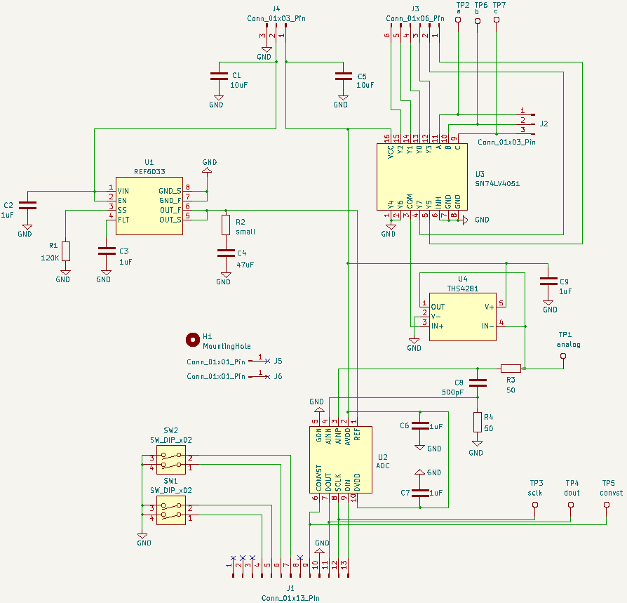

# Six Channel Analog (SCA) Version 0.0

## Introduction
Data conversion board for IPS 2.0.

Small size, low cost PCB.

Designers can experiment with different ADC front-ends without having to make a new IPS 2.0 board.

Compared to IPS 2.0, the more difficult to solder parts are on the SCA PCB. Mistakes are localized to a small, low-cost board.

## Features

### I/O
* 6 analog inputs, with signals in range [0, Vmax].
* 3 digital inputs (a, b, c) for selecting one of the 6 analog inputs.
* SPI interface.
* Eleven digital inputs/outputs, for any purpose, connected to the mainboard. Typical use is controlling the ADC or providing a fast word-wide interface to the Teensy.

### Power
* 5 volt input.
* 3.3 volt input - for digital components.
* 3.3 volt input - for analog components.
* Ground connection at SPI/digital interface.
* Optional ground connection at power interface.

### Size
* 3.6 inches long.
* 1.3 inches tall.

### Hold Down
One optional 2.2mm screw.

## Description
The SCA receives 6 analog inputs with range [0, Vmax]. The value Vmax is determined by the analog-to-digital converter (ADC) reference integrated circuit (IC). The reference is a Texas Instruments REF60XX, with the following options.

| Part | Vmax |
| - | - |
| REF6025 | 2.5V
| REF6030 | 3.0V
| REF6033 | 3.3V

The digital inputs (a, b, c) determine which analog input is routed to the ADC.
|c|b|a| pin number|
|-|-|-|-|
|0|0|0|4|
|0|0|1|5|
|0|1|0|6|
|0|1|1|3|
|1|0|0|none (ground is selected)|
|1|0|1|1|
|1|1|0|none (ground is selected)|
|1|1|1|2|

The ADC is a Texas Instruments ADS8860.

Connects to Integrated Processing System (IPS) 2.0 board.

## Schematic
