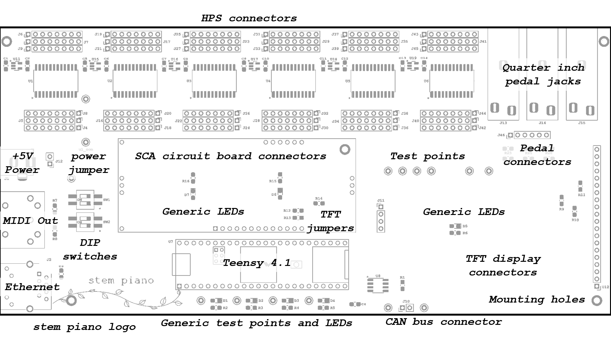

# Integrated Processing System 2 (IPS2) specification

Requires a Six Channel Analog (SCA0) card.

## Requirements

### I/O
* Either:
  * Analog interfaces to 88 hammer sensor boards, or
  * Analog interfaces to 88 damper sensor boards.
* 3 pedal inputs: 1/4 inch.
* MIDI output.
* Ethernet interface (optional).
* 5 volt, 2.5 amp power input. *WARNING* - do not connect when a USB cable is connected to the Teensy 4.1.
* CAN bus.

### Capabilities
* Process hammer samples and generate MIDI outputs.
* Process damper samples and send to hammer processing board.
* Process pedal samples and generate MIDI outputs.
* Dual in-line package switches for configuration.
* Optional advanced monitoring, setup, and analytics over Ethernet and web brower.
* Optional hammer and pedal data over Ethernet using the piano network protocol (PNP).
* Optional TFT display for setup.

### Components
* Highly available, not likely supply chain constrained.
* Relatively large pitch, easy to solder parts.

## Form
* 8.5 inches by 4.0 inches.
* Single board.
* Low profile.

## Top Level PCB Description

### HPS connectors
0.1 inch spaced connectors for connecting wires to the Hammer Position Sensor boards.

#### Quarter inch pedal jacks
For connecting pedals.

#### Pedal connectors
0.1 inch spaced connectors. Connect to six of the HPS connectors. See instructions in the *packages/* directory for this board.

### +5V power
External power connection. **WARNING** - Do not connect external +5V power while Teensy 4.1 is connected to a USB cable.

### Power jumper
As an extra safety measure, disconnect this jumper and the +5V power input when Teensy 4.1 is connected to a USB cable.

#### MIDI Out
Five-pin MIDI output connection. The board does not have a MIDI input.

#### Ethernet
Ethernet connection.

#### DIP switches
For simple configuration settings. Programmable with the Teensy firmware. See code for functionality.

#### SCA circuit board connectors
The analog-to-digital conversion (ADC) subsystem is on a separate, removable, card that connects to the IPS printed circuit board. This simplifies and reduces the cost of testing an ADC and enables experimenting with different hammer or damper ADC resolution and sampling rates. Also, ADC parts can often be in packages that are difficult to solder. A separate circuit board lowers the cost and impact of soldering mistakes.

#### Generic test points and LEDs
Programmable test points and LEDs through the Teensy firmware.

#### Teensy 4.1
What makes everything possible.

#### TFT jumpers
Zero-ohm resistors. If not using a TFT, can leave these out.

#### CAN bus connector
Connect two wires between hammer and damper circuit boards. If not using a damper circuit board then leave these disconnected. Connect each wire to the same location on the other board (left side of connection to left side, right side to right side).

#### TFT display connectors
Connection for optional 2.8 inch display.

#### stem piano logo
Yeah!!
