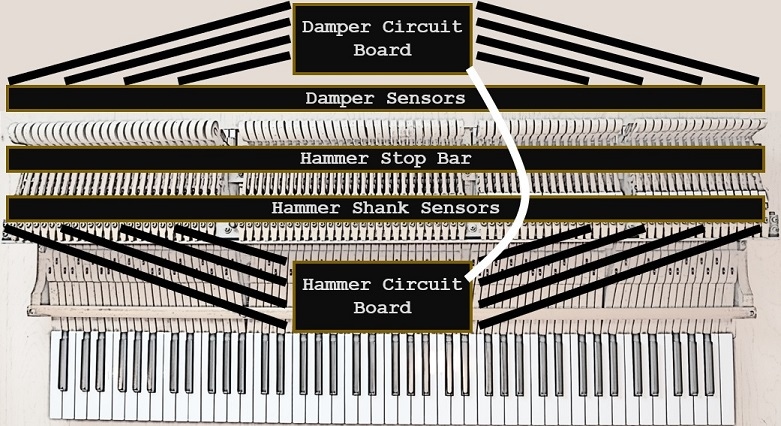

# Mechanical Design

## Overview

The design is very flexible:
* Will work on grand and upright pianos.
* Will work with the action separate from the piano or as a silent system in a full piano.
* Will work with a digital keyboard, using sensors on the digital keys.
* Can use as part of innovative new musical instruments.

In the *documentation/* directory under the root directory is a file called video_documentation.md.  Please see for installation examples.

## Grand Piano - Separate Action Examples

### Stem Piano Model G

#### Damper Sensors

An aluminum L-shaped bar is placed across the back of the action. The damper sensors are mounted on this bar.

Connect the damper sensors to the circuit board that is processing the damper sensor output signals.

#### Hammer Stop Bar

Connect a strong steel bar that is anchored to something solid. Adjust height so that the hammer shanks hit this stop at the position where in a full piano the hammer would have hit a string.

#### Hammer Shank Sensors

An aluminum L-shaped bar is placed across the top-front of the action. The hammer sensors are mounted on this bar.

Connect the hammer sensors to the circuit board that is processing the hammer sensor output signals.

## Grand Piano - Silent System Examples

## Upright Piano - Separate Action Examples

## Upright Piano - Silent System Examples

## Innovative Instruments Examples