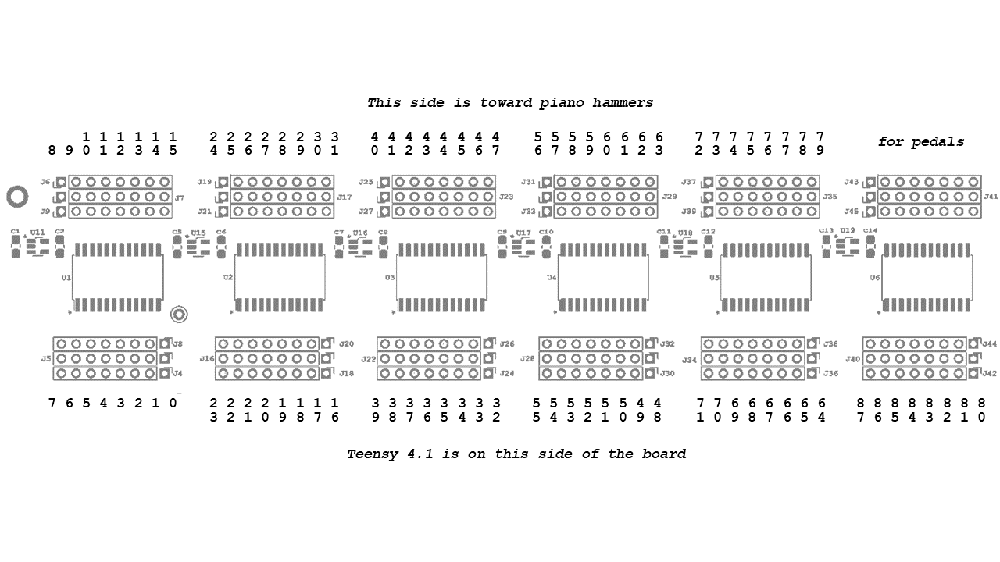
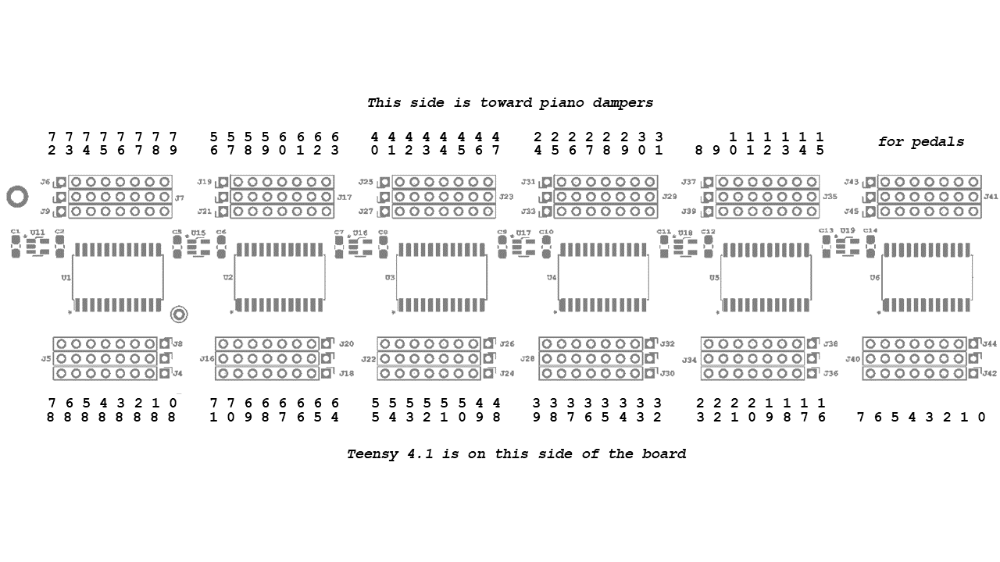
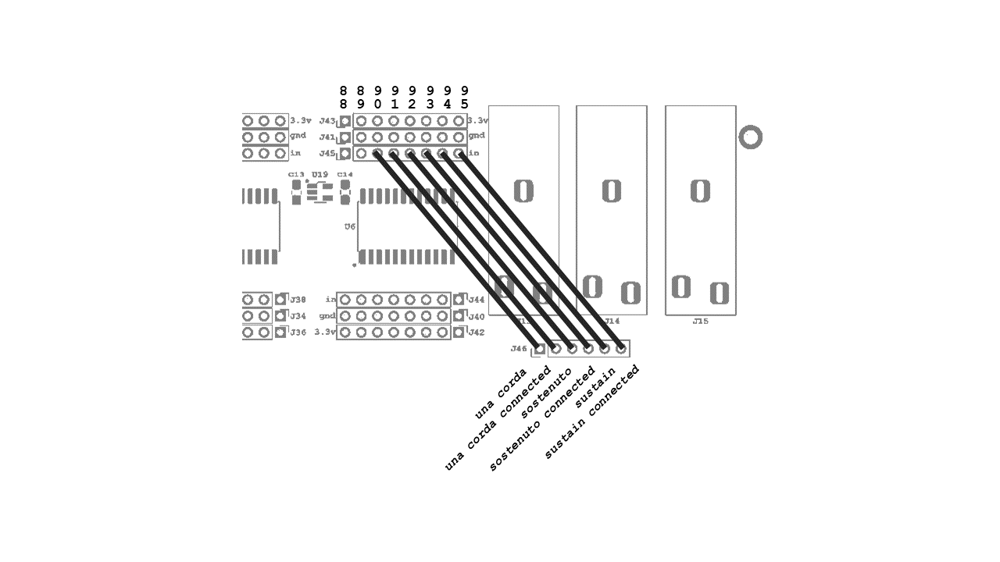

# Stem Piano Model G

The first release of Stem Piano is the Model G.

## Timeline

Release is presently **under construction**.  Goal is everything posted no later than October, 2023.

## Features

* Will work on grand and upright pianos.
* Will work with the action separate from the piano or as a silent system in a full piano.
* Will work with a digital keyboard, using sensors on the digital keys.
* Sends data via 5-pin serial MIDI.
* Measures and sends hammer velocity and, optionally, damper velocity over MIDI.
* Includes three, quarter-inch jacks, for pedals.
* Accepts up to 96 inputs. Therefore, will work for pianos with more than 88 keys.
* Optional 10/100 Mbit Ethernet port for configuration, status, and debug.
* Optional 2.8" TFT display for configuration and debug.
* Four DIP switches for simple configuration.

## Required Components

Until the Stem Piano Model G is fully released, and the overall repo is in a
finished state, some code may be in releases/ directories and some in
research/ directories.
This will all be cleaned up at time of full (official) release.

#### [StemPianoIPS2 Library link](../../firmware/releases/StemPianoIPS2/)
Arduino library firmware that runs on the Integrated Processing System 2 (IPS2) hardware. Must manually copy to the location where Arduino library code is located.

#### [Hammer Firmware link](../../firmware/research/ips2_hammer/)
Main Arduino code for the Teensy 4.1 processor on the IPS2 hardware.
Use this code as the Arduino sketch code.

#### [Hammer Position Sensor 0.6 link](../../hardware/releases/hps06/)
#### [Hammer Position Sensor 0.4 link](../../hardware/releases/hps04/)
Either hammer position sensor (HPS) board will work.
Eighty-eight (or more) boards are required, one for each hammer.

#### [Six Channel Analog 0 link](../../hardware/research/six_channel_analog/)
The six channel analog card with ADC that removably connects into the IPS2 mainboard.

#### [Integrated Processing System 2 link](../../hardware/research/integrated_processing_system_2/)
The Integrated Processing System 2 mainboard.  In this directory is a detailed PCB diagram.

## Optional Components

#### [Damper Firmware link](../../firmware/research/ips2_damper/)
Main Arduino code for the Teensy 4.1 processor on the IPS2 mainboard.

With a damper measurement system, a second IPS2 mainboard and second SCA0 card are required.
Also, 88 HPS (or more) boards are required, one for each damper.

## Purchasing Parts and PCB Fabrication

The bill of materials file in each *hardware/* subdirectory lists all parts required to build the boards.

For PCB fabrication, use the gerber files in each *hardware/* subdirectory. Often a manufacturer will request putting all gerber files in a single .zip directory.

## Hardware Build and Assembly

Please see the following YouTube video (*NOT DONE YET*) for soldering, build, and assembly instructions in video form.

All components on IPS2 were selected for ease of soldering. They are also mature parts that should have good availability or with good substitute options.

The analog-to-digital conversion (ADC) subsystem is on a separate, removable, card (SCA0) that connects to the IPS printed circuit board. This simplifies and reduces the cost of testing an ADC and enables experimenting with different hammer or damper ADC resolution and sampling rates. Also, ADC parts can often be in packages that are difficult to solder. A separate circuit board lowers the cost and impact of soldering mistakes.

The IPS2 board comes with an optional external +5V supply connection. The external supply must be able to deliver at least five amps.

**WARNING** --- Do not connect an external +5V supply at the same time as the Teensy 4.1 USB programming cable is connected. This could short the computer connected to the USB, with the +5V supply connected to the IPS2, and damage the computer. Please see the PJRC Teensy 4.1 website for more details on this issue http://prjc.com. The IPS2 circuit board has a dedicated jumper as an extra reminder. --- **WARNING**

## Hardware Connections
### Hammer Connections
Hammers are numbered starting at A0 (0), through C8 (87).

### Damper Connections
Damper keys are numbered starting at A0 (0), through C8 (87).

### Pedal Connections
Connect jumper wires as shown in figure.
Three of the connection wires are optional (sustain connected, sostenuto connected, and una corda connected). Also, in many cases a sostenuto and una corda pedal are not used. Therefore, up to seven keys beyond the traditional 88 keys can be connected (total of 95 keys).

## Piano Action and Frame

Please see the following YouTube video (*NOT DONE YET*) for soldering, building, and assembly instructions.

Three metal bars are needed:
* A bar to stop the hammers. This bar must be very strong and mounted to a solid surface.
* A bar for mounting the HPS circuit boards to measure hammer location.
* An optional bar for mounting the HPS circuit boards to measure damper location.

When mounting Stem Piano Model G inside a piano, it is possible to break each bar into smaller sub-bars to fit within the structure.

## Firmware Compiling and Running
-- instructions in progress --
Warnings - Ethernet, ImageReader
Wire2
SdFAT

## Firmware Features
-- instructions in progress --

## Firmware Settings
-- instructions in progress --

## Using MIDI
-- instructions in progress --

## Using Ethernet
-- instructions in progress --

## TFT Screens and Features
-- instructions in progress --

## Warnings
-- instructions in progress (all warnings will eventually be consoldiated into one location) --
* Static sensitive.
* Recommend lead free solder.
* Do not simultaneously connect external +5V power and USB Teensy connection.
* Use an external fuse on +5V power input.
* Use Low Dropout Regulators (LDO) that include short-circuit protection.
* Some pins are at power and some at ground. Be careful not to connect them together.
* Use the 2.8" TFT unmodified. For example, the TFT IM1, IM2, and IM3 pins are connected to +3.3V on the PCB. Therefore, these jumpers internal to the TFT should *not* be soldered together, as described on manufacturers website.

## Troubleshooting
-- instructions in progress --
* No sound - (1) verify not in board bring-up mode, (2) put an oscilloscope on *analog* test point of SCA card and verify that the signal is changing when press a key, (3) set debug mode and check that serial output prints that MIDI commands are being sent, (4) try connecting MIDI cable to another keyboard, (5) turn on speakers.
* Very quiet sound - (1) check distance of sensor to hammer.
* Very loud sounds
* Cannot download code to Teensy - (1) try pushing download button, (2) sometimes this can appear to be happening but it is due to a buffer overflow in code
* System does not power-up - (1) not good!
* Board hangs at power-up - (1) potential buffer overflow in code
* Ethernet does not work - (1) on correct subnet? (2) have a VPN running? (3) going through a switch or router? (4) try wireshark.
* Using two boards and dampers do not work
* Random dropped notes - (1) probably due to hammer settings... (TODO - more details)
* Note repetition is erratic - (1) probably due to hammer settings... (TODO - more details)
* Some notes work, but some do not - (1) probably due to hammer settings... (TODO - more details), (2) verify not in board bring-up mode.
* Some notes are quieter or louder than others
* MIDI command overload - (1) restart everything with MIDI disconnected, then connect.
* No MIDI messages received by MIDI receiver
* Pedals do not work - (1) double check wiring
* Pressing a pedal causes a note to play - (1) pedals are probably connected to one of the 1-88 inputs that are supposed to be for hammers
* Sustain, sostenuto, or una corda does not release
* TFT screen is blank
* TFT works but touch screen features do not work
* TFT SD card does not work - (1) try a different card, (2) does it make a difference if using USB or external power? try restarting via USB
* Teensy continuously reboots - (1) potential buffer overflow in code
* Why are there so many warnings when building the code? - (1) long story (SD card hack)... but they will mostly go away on second build.