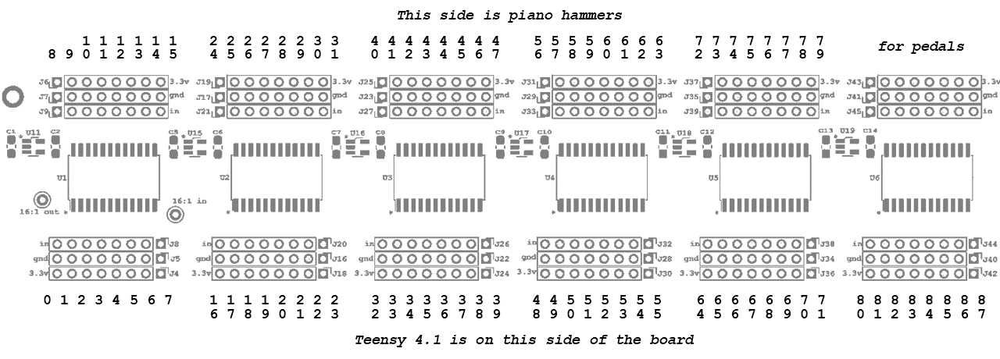
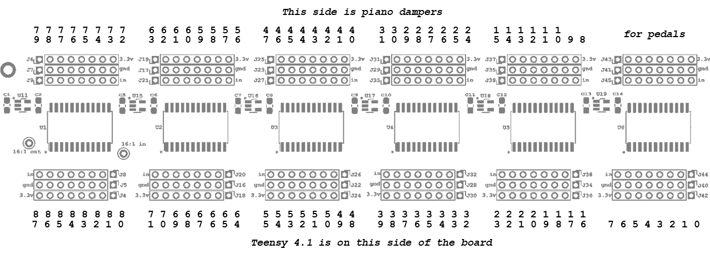
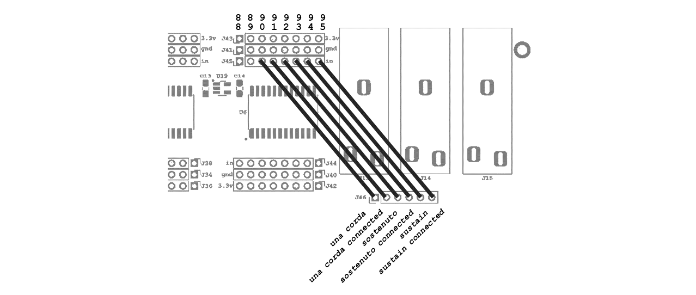

# Stem Piano Model G

The first release of *Stem Piano* is the Model G.

If you build a piano, please share about it in the *Show & Tell* Discussions of this repository.

Location of detailed step-by-step build instructions: [build_instructions_0_stem_piano_g.md](build_instructions_0_stem_piano_g.md).

Location of recommended and optional assembly tools: [tools_stem_piano_g.md](./tools_stem_piano_g.md).

## Features

* Works on grand and upright pianos.
* Works with the action separate from the piano or as a silent system in a full piano.
* Works with a digital keyboard (sensors may need modification).
* Can use as part of creating innovative new musical instruments.
* Sends data via 5-pin serial MIDI.
* Measures and sends hammer velocity and, optionally, damper velocity over MIDI.
* Includes three jacks, quarter-inch, for pedals.
* Accepts up to 96 inputs. Therefore, will work for pianos with more than 88 keys.
* Optional 10/100 Mbit Ethernet port for configuration, status, and debug.
* Optional 2.8" TFT display for configuration, status, and debug.
* Four DIP switches for simple configuration.

## Components of the Piano - Overview

The piano requires two printed circuit boards (PCB).
* Mainboard (called "IPS")
* Data acquisition board (called "SCA"). The data acquisition board removably attaches to the mainboard.

The piano also requires two sets of firmware.
* "StemPiano IPS2" Firmware - this code is shared between hammer and damper processing.
* Hammer Firmware - this code is unique to the hammer processing.

The piano requires 88 hammer sensor boards (HPS). All 88 sensor boards connect to the mainboard (IPS). Optionally, can add an additional 88 damper sensors boards. The hammer and damper sensor boards are identical.

If adding damper processing, then an additional IPS and an additional SCA set of printed circuit boards are required, plus the Damper Firmware.

One, two, or three standard piano pedals can connect to the mainboard (IPS). The connection is with a quarter-inch jack.

Each IPS board includes an Ethernet port. This port is not required but is useful for transmitting debug data information to a computer. The port is also useful for more advanced configuration or analytics. Software running on an external computer, that receives and processes the Ethernet data, is called "IPS2Analytics". Use of this software is optional.

Connect a MIDI cable to the mainboard (IPS) that is connected to the hammer sensors. If using a damper mainboard (also called IPS because it is an identical board as the hammer mainboard), it connects to the hammer mainboard (IPS) using Can Bus. A MIDI cable is not required to the damper mainboard (IPS).

The next section provides more details of each component as well as a link to the component code or hardware files.

## Required Components - Details

Each of the following directories contains a README.md with information on how to use the component.

### StemPianoIPS2 Firmware

Link: [StemPianoIPS2 Firmware](../../firmware/releases/StemPianoIPS2/)

Arduino library firmware that runs on the Teensy processor of the Integrated Processing System (IPS) mainboard hardware. Shared code for both hammer and damper processing. Copy this code to the Arduino library location or to the same directory as the hammer firmware.

### Hammer Firmware

Link: [Hammer Firmware](../../firmware/releases/ips2_hammer/)

Main code for the Teensy processor on the IPS mainboard hardware.
Use this code as the Arduino sketch code. May need to rename the top-level file from .cpp to .ino.

The settings file is located in this directory. The settings file is very important as it controls all detailed configuration of the piano.

### Six Channel Analog PCB

Link: [Six Channel Analog PCB](../../hardware/releases/sca00/)

The six channel analog (SCA) card contains the data acquisition processing. This PCB removably connects into the IPS mainboard. In the SCA directory are the files needed for PCB fabrication and a list of all components for the board.

One SCA board per IPS board. For example, one SCA and one IPS together support 88 piano hammers. If processing dampers separately, then another SCA with another IPS support the 88 piano dampers.

### Integrated Processing System PCB

Link: [Integrated Processing System PCB](../../hardware/releases/ips20/)

The Integrated Processing System (IPS) mainboard. In this directory are the files needed for PCB fabrication and a list of all components for the board.

### External +5 Volt Power Supply

See the IPS readme file for specifications on the external power supply.

### External Damper Pedal

For an explanation of the pedals and pedal requirements, see video on my YouTube channel https://www.youtube.com/watch?v=9sqkgVXceJU at approximately the 15 second time mark.

### Table for Action

A strong table is required. For proper playing height, select a table that positions *stem piano* at the same height as an acoustic piano.

### HPS to IPS Connecting Wires

Each connection needs 3 wires. Hammer sensors require 3*88 = 264 wires and damper sensors require another 264 wires. As an example of connection approach, see video on my YouTube chanenl https://www.youtube.com/watch?v=gNeLMGaxmG0 at approximately the 1:40 time mark.

## Optional Components - Details

Each of the following directories contains a README.md with information on how to use the component.

### Damper Firmware

Link: [Damper Firmware](../../firmware/releases/ips2_damper/)
Main code for the Teensy 4.1 processor on the IPS mainboard. When using a damper measurement system, a second IPS mainboard and second SCA card are required.

If the damper measurement system is not installed, the hammer firmware will estimate the damper location based on the hammer sensor inputs. A value in the settings file controls whether using hammer or damper to get damper information.

### Hammer Position Sensor Board

Three options:

* With adjustable output voltage level and using surface mount technology. On this board the pins are in the same order as the pins on IPS 2.0. Link: [Hammer Position Sensor 0.7 PCB](../../hardware/releases/hps07/)
* Similar to HPS 0.7 except the pins are not in the same order as IPS 2.0. Not recommended for use with *Stem Piano Model G*. It is useful for other future pianos. Link: [Hammer Position Sensor 0.6 PCB](../../hardware/releases/hps06/)
* Without adjustable output voltage. Through-hole resistors. Link: [Hammer Position Sensor 0.4 PCB](../../hardware/releases/hps04/)

Any hammer position sensor (HPS) board at the links above will work.
Eighty-eight (or optionally more) HPS sensor boards are required, one for each hammer. When using a damper board, eighty-eight (or optionally more) HPS sensor boards are required, one for each damper.

It is also possible to use other sensors, which is why these HPS boards are listed as optional. However, some form of sensor is required.

The sensor boards must output an analog value in range [0, ..., 2.5] volts when the hammer or damper is furthest-from and closest-to the sensor respectively. It is ok to send a value less than 2.5 V, such as 2.3 V or even lower. Lower voltages could require adjusting the settings in settings file. See the following file for a detailed explanation: [../../design/hps_cny70/hps_cny70.md](../../design/hps_cny70/hps_cny70.md)

The maximum allowable current draw of each sensor board is 15 mA.

### IPS2Analytics Software

Link: [IPS2Analytics Software](../../software/releases/ips2_analytics/)

Optional Python software for acquiring and displaying data from the Ethernet connection.

### Mechanical Ideas

Link: [Mechanical Ideas](../../mechanical)

Examples of mechanical configurations. Also, wiring suggestions are in this directory.

## Purchasing Parts and PCB Fabrication

The bill of materials file in each *hardware/* subdirectory lists all parts required to build the boards.

Send the gerber files in each *hardware/* subdirectory to the manufacturer. Often a manufacturer will request putting the gerber files in a single .zip directory.

## Hardware Build and Assembly

Please see the following file for soldering, build, and assembly instructions: [build_instructions_0_stem_piano_g.md](build_instructions_0_stem_piano_g.md)

All components on IPS were selected for ease of soldering. They should have good availability or with ok substitute options.

The analog-to-digital conversion (ADC) data acquisition subsystem is on a separate, removable, card (called the SCA) that connects to the IPS mainboard. This simplifies and reduces the cost of testing an ADC and enables experimenting with different hammer or damper ADC resolution and sampling rates. Also, ADC parts can often be in packages that are difficult to hand solder. A separate circuit board lowers the cost and impact of soldering mistakes.

The IPS board includes an optional external +5V supply connection. The external supply must be able to deliver at least five amps.

## Hardware Connections

### Hammer Connections
The following figures show the top of the IPS mainboard. This is where the sensor connectors are located.

Hammers are numbered starting at piano note A0 (key number 0), through piano note C8 (key number 87) in the first figure. Connect each set of three pins (power, ground, and signal) to the same three pins on each of the 88 sensors boards.

### Damper Connections
Damper keys are numbered starting at piano note A0 (0), through piano note C8 (87).

### Pedal Connections
Connect jumper wires as shown in figure for the IPS mainboard connected to hammer sensors. While it is possible to also use the damper IPS mainboard for pedal connections, the firmware is not presently setup to support this option. Note that with both hammer and damper pedal connections, a total of 6 pedals could be available.

Three of the connection wires are optional (sustain connected, sostenuto connected, and una corda connected). Also, in many cases a sostenuto and una corda pedal are not used. Therefore, up to seven keys beyond the traditional 88 keys can be connected (total of 95 keys if using only a single pedal).

Pedal signals are not hardwired on the PCB. Therefore, these jumpers enable connecting pedals in many different configurations.

## Piano Action and Frame

See the [mechanical/](../../mechanical/) directory for mechanical design and instructions.

Three metal bars are needed:
* A bar to stop the hammers. This bar must be very strong and mounted to a solid surface.
* A bar for mounting the sensor (for example HPS) circuit boards to measure hammer location.
* An optional bar for mounting the sensor (for example HPS) circuit boards to measure damper location.

When mounting Stem Piano Model G inside a piano, for a silent piano system, it is possible to break each bar into smaller sub-bars to fit within the structure.

## Firmware Compiling and Running
See the Teensy 4.1 web pages (https://www.pjrc.com/) for required Arduino software setup and required libraries.

If using the optional Adafruit 2.8" TFT, then check the Adafruit web pages for library installation instructions. The Adafruit 2.8" TFT requires an AdaFruit library for the SD card that conflicts with the library for the SD card on the Teensy. As a temporary fix, after all libraries are installed, delete the SdFat/ directory from the Teensy library location (instead of deleting, it is probably better to move the directory to another location in case the directory is needed for another project in future). Deleting SdFat/ will cause warnings when building the project.

If not using the optional Adafruit 2.8" TFT, comment out the TFT #define in *stem_piano_ip2.h*. Then the Adafruit 2.8" TFT is not required and deleting the Teensy SD library is not required.

## Firmware Settings
See hammer_settings.cpp in [Hammer Firmware (link)](../../firmware/releases/ips2_hammer/). This file contains detailed comments around each setting value.

## MIDI

The only music related output of Stem Pian G is MIDI. Connect a 5-pin DIN to the MIDI output port on the IPS 2.X board.

Use external software to receive MIDI, convert to musical sounds, and that sends to speakers or headphones.

## Ethernet
See [Analytics (link)](../../software/releases/ips2_analytics/) for example software that receives Ethernet data from the board.

## TFT Touch Screen Features
The Adafruit 2.8" TFT touch screen is optional.

Install the 2.8" TFT unmodified. The TFT IM1, IM2, and IM3 pins are connected to +3.3V on the IPS 2.X PCB. Therefore, these jumpers internal to the TFT should *not* be soldered together (the manufacturer website may describe soldering them together).

Usage:
* Change DIP switch SW2 #1 to the ON position to enable the Touch Screen TFT mode. Change the DIP switch to the not-ON position to disable the Touch Screen TFT mode. When in Touch Screen TFT mode, MIDI output from the piano is disabled.

* During Touch Screen TFT mode the Analog to Digital Converter (ADC) sampling rate slows to approximately 100 samples per second. The display shows the maximum value of all hammer and damper signals, in range [0.0, ..., 1.0]. For setup, use this capability to raise one key at a time and verify proper sensor height and position. The display is also useful for level calibration, if using an external sensor with a trimmer resistor.

## Video Documentation

Please see [YouTube Posts](../../documentation/video_documentation.md) for historical, how-to, and other documentation in video form. Not all is relevant but some videos could be helpful when building a piano.

## Warnings
Please see the [WARNINGS.md](../../WARNINGS.md) file in root directory.

## Troubleshooting
Please see the [HELP.md](../../HELP.md) file in the root directory.

## Cost Estimates (2023)

Each bill of materials file in the hardware directories includes parts cost estimates. USD units.

The estimates assume purchasing single quantities and prototype boards. It should be possible to lower these costs.

Here is a summation of all the parts costs in the bill of materials files:

Component costs.

* IPS mainboard - minimal options (no TFT display, no LED, no test points, no Can bus, no Ethernet, no config switches) - $120.
* IPS mainboard fully populated - $175.
* SCA data acquisition card - minimal options - $45.
* SCA data acquisition card fully populated - $50.
* HPS 0.6 or HPS 0.7 (with trimmer resistor) - $7.50.
* HPS 0.4 (without trimmer resistor) - $2.15.

Total cost for the least expensive system.
* No display, LEDs, test points, Ethernet, or configuration switches.
* No separate IPS and SCA for damper processing.
* No damper sensors. Damper position is estimated in firmware from hammer position.
* No trimmer resistors on HPS hammer sensors.
* Total = $120 + $45 + 88 * $2.15 = $354.20.

Total cost for the most expensive system.
* All features - boards are fully populated.
* Separate processing for dampers.
* Trimmer resistors on sensors for fine tuning calibration. The piano firmware autocalibrates sensor variations. Experiments show that trimming resistors may not add much benefit (see status file in root directory for updates). But they are a very expensive option since 88 (or 176) are required.
* Total = 2 * ($175 + $50 + 88 * $7.50) = $1770.

The above estimates do not include the mechanical equipment cost (sensor bars and hammer stop bar), the pedal cost, the external power supply cost, or the piano action cost. Also, a sturdy table is required.

The above estimates do not include cost for time of construction, soldering, assembly, sleepless nights debugging and troubleshooting.